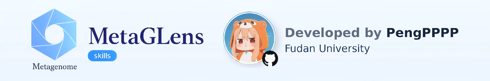

<p align="center">
  
</p>

# MetaGLens

Reproducible shotgun-metagenomics pipeline orchestrator: paired raw reads →
quality-controlled reads → assembly → coverage → genome bins → quality-filtered
and dereplicated MAGs → taxonomy → functional annotation → a self-contained
interactive delivery report.

MetaGLens is the software form of the MetaGLens skill bundle. Instead of an AI
agent filling in shell templates, a deterministic command-line tool collects a
project configuration, discovers paired samples, renders the bundled stage
scripts into runnable Bash, and drives them to completion with resumable state
tracking in `pipeline_status.json`.

The generated scripts are **standalone and inspectable** — you can read, edit,
and run them without MetaGLens once they are materialized.

## Demo

Configure, run, and inspect the whole pipeline in your browser — no installation
required:

<p align="center">
  
</p>

**Try the interactive demo:** <https://PengPPPP.github.io/MetaGLens/> — a
self-contained page where you can configure a project, run the pipeline, switch
between analysis routes, and probe the safety boundary.

Run it yourself in seconds with `metaglens demo` (stub toolchain, no scientific
output), or open the same showcase page locally with `metaglens showcase`.

## Install

```bash
git clone https://github.com/PengPPPP/MetaGLens.git
cd MetaGLens
pip install .
# or, for development:
pip install -e .
```

This installs the `metaglens` command. Python ≥ 3.8 and PyYAML are required.
The bioinformatics tools (fastp, MEGAHIT/metaSPAdes, Bowtie2/bwa-mem2, samtools,
MetaBAT2, MaxBin2, CONCOCT, DAS Tool, CheckM2, dRep, GTDB-Tk, Kraken2, Bracken,
Prokka, eggNOG-mapper) are provided through conda; MetaGLens can create or reuse
the environments during setup.

## Quick start

```bash
metaglens init                 # interactive wizard -> writes metaglens.yaml
metaglens demo                 # offline self-check with stub tools (no science)
metaglens configure            # OR configure in a local web page (loopback + token)
metaglens doctor               # check tools / databases / hardware for this route
metaglens db list              # which reference databases this route needs
metaglens plan                 # stage table: est. time, peak RAM, disk, blockers
metaglens validate             # check config + dry-render every stage script
metaglens run --dry-run        # render + bash -n, without executing
metaglens run                  # materialize and execute the whole route
metaglens run --from 04_binning  # run from a specific stage onward
metaglens run --only 07_taxonomy # run only the named stage(s), comma-separated
metaglens recommend            # resource suggestions for this machine, with reasons
metaglens status               # show stage progress
metaglens watch                # live terminal dashboard (read-only)
metaglens monitor              # write a self-refreshing monitor.html (open via file://)
metaglens gate                 # check scientific quality metrics
metaglens diagnose             # explain why a stage failed
metaglens explain <topic>      # what a stage/parameter/failure means
metaglens resume               # continue from the first incomplete stage
metaglens report               # (re)build delivery/report.html
metaglens methods              # Methods text for the stages that actually ran
metaglens routes               # list routes and their steps
metaglens setup-env            # one-shot conda environment creation
```

All commands accept `-c/--config PATH` (default `metaglens.yaml`).
`--only` and `--from` steps are validated against the selected route, so a
misspelled stage id fails fast instead of silently running nothing.

## Self-check: `metaglens demo`

After installing, this is the first thing to run:

```bash
metaglens demo                       # both routes, a few seconds
metaglens demo --route contig_based  # one route
metaglens demo --keep                # keep the temp dir for inspection
metaglens demo --json                # machine-readable result
python3 -m metaglens.demo            # no typer/rich needed (CI-friendly)
```

It creates a throwaway project with synthetic reads, renders the **real** stage
scripts, and runs them to completion against a **stub toolchain** — so stage
control flow, the resumable status file, product validation, and both the
delivery report and the monitor page are all exercised for real, not merely
syntax-checked. It needs no conda environment, no reference databases, and no
network, and it only ever writes inside its own temporary directory.

> **It produces no scientific results.** Every tool is a stub emitting the
> minimal artefact the next stage reads; all sequences and numbers are
> placeholders. `demo` proves the plumbing works — nothing about biology.

Both `mag_per_sample` and `contig_based` are covered, so the whole
delivery chain (including the community-table source selection) is verified.

## Preflight: doctor / db / plan

Three read-only commands answer "will this run actually work?" **before** you
spend hours of compute. All three accept `--json` and exit non-zero when
something would block the run, so they also work as CI or script gates.

```bash
metaglens doctor              # tools, databases, hardware vs. what this route needs
metaglens doctor --env myenv  # inspect a specific conda environment
metaglens doctor --fix        # install only the missing required packages
metaglens db list             # required databases and whether they are ready
metaglens db where gtdbtk     # full resolution chain, and which level won
metaglens db verify gtdbtk /path/to/db
metaglens db get checkm2 /data/db/checkm2
metaglens plan                # stage table: time / peak RAM / disk, plus blockers
metaglens plan --plain        # paste-able summary for a resource request
```

**`doctor`** reports each tool's package version *and* whether the command is
actually runnable — a package showing up in `conda list` does not mean the
executable is on your `PATH`. Tools the selected route never invokes are listed
but marked *not needed*, and can never fail the check; only genuinely required
tools count. `--fix` installs **only** what is missing and **never upgrades** an
existing package, after asking for confirmation.

**`db`** keeps database handling honest:
- `where` prints the whole chain — config path → environment variable →
  filesystem scan → default location — and marks which level supplied the path.
- `verify` is strictly read-only; nothing is ever written into a database
  directory, because a shared install usually is not writable by you.
- `get` requires an **explicit destination** (no surprise default location),
  refuses unless free space covers the size plus a 1.2× extraction margin, and
  downloads only after you confirm. Databases without an official fetch command
  print the official instructions rather than a guessed URL.

**`plan`** lists every stage with its execution mode, estimated wall time, peak
memory and disk growth, plus a total. **Estimates are coarse (±50%)** and say so,
along with the sample size they assume — a labelled order-of-magnitude figure is
useful, a fake-precise one is not. Missing databases are reported with the exact
`metaglens db get` command to fix them. `metaglens plan --plain` prints a
plain-text summary suitable for emailing a supervisor or cluster admin when
requesting resources; it also records that MetaGLens needs no API key, makes no
outbound calls during analysis, and incurs no metered charges.

## Sample discovery

MetaGLens pairs reads automatically, supporting `_R1_001/_R2_001`, `_R1/_R2`,
`_1/_2`, and `.1/.2`. Both flat and nested layouts work:

```
flat                          nested (per-sample directories)
raw/S1_R1.fastq.gz            raw/SampleA/SampleA_R1.fastq.gz
raw/S1_R2.fastq.gz            raw/SampleA/SampleA_R2.fastq.gz

nested (generic filenames, sample = directory name)
raw/S1/reads_1.fq.gz   raw/S2/reads_1.fq.gz
raw/S1/reads_2.fq.gz   raw/S2/reads_2.fq.gz
```

- **Mates are only ever paired inside one directory.** An R1 from one folder can
  never be matched with an R2 from another, so samples cannot be silently
  swapped.
- **Sample ids** come from the file name when those are unique; otherwise from
  the parent directory name. If both collide, discovery **fails and asks for a
  manifest** rather than inventing numbering.
- Sub-directories are scanned up to 3 levels deep; hidden directories are
  skipped and symlink loops are handled.
- `metaglens init` and `metaglens configure` show the detected convention,
  layout, and where ids came from, and let you **rename or exclude** samples.
  Doing so writes a `samples.tsv`.
- A `samples.tsv` manifest (columns `sample_id`, `r1`, `r2`) is the ultimate
  fallback — set `sample_manifest` in the config and it is used verbatim.

## Web configuration (optional)

If your server has a desktop/browser, `metaglens configure` opens a local web
form as an alternative to the terminal wizard:

```bash
metaglens configure                 # opens a browser form
metaglens configure --lang en       # English UI (default: zh)
metaglens configure --no-browser    # headless: prints a URL to port-forward
```

The page checks hardware, recommends a parallel plan, discovers or validates
database paths, and lists the samples it finds — then writes `metaglens.yaml`.

- **Loopback only.** The service binds `127.0.0.1` on an OS-assigned port and
  every request requires a one-time token embedded in the printed URL. It is
  never exposed on a routable interface. Assumed single-user.
- **Same config as the wizard.** The form writes YAML through the same
  `Config.validate()` the terminal wizard uses, so both entry points produce
  identical files. The UI language does not affect the produced YAML.
- **No GUI?** Run with `--no-browser`, forward the printed port
  (`ssh -L 8000:127.0.0.1:<port> user@host`), and open the URL locally — or just
  use `metaglens init` in the terminal.

## Live monitor (optional)

`metaglens monitor` writes a self-contained, self-refreshing `monitor.html` into
the results directory. Open it with `file://` — no server required:

```bash
metaglens monitor                   # rewrite every 5s until Ctrl-C
metaglens monitor --interval 10     # refresh every 10s
metaglens monitor --once            # write a single snapshot and exit
```

It shows the stage timeline, the current stage, and the tail of that stage's
log, and it keeps working after the run finishes or crashes (the file always
reflects the last written state). It is a side-car that reads
`pipeline_status.json` and logs only — it never affects the run. The terminal
`metaglens status` view remains available.

## One-shot conda environment setup

Create all pipeline tool environments in **one command** — you choose the name:

```bash
metaglens setup-env -n mytools           # creates mytools_qc, mytools_binning, mytools_mag
metaglens setup-env -n mytools --single  # all tools in one environment (may conflict)
metaglens setup-env --dry-run            # preview conda commands without executing
```

The default (3-group) layout avoids dependency conflicts between gtdbtk/checkm2/
concoct/prokka and the QC tools. If `metaglens.yaml` exists, the environment name
and `conda_mode` are automatically updated.

You can also specify which groups to create:

```bash
metaglens setup-env -n tools --groups qc,mag   # only QC + MAG groups
```

| Group | Environments | Tools |
|---|---|---|
| qc | `{name}_qc` | fastp, megahit, spades, bowtie2, bwa-mem2, samtools, seqkit |
| binning | `{name}_binning` | metabat2, maxbin2, concoct, das_tool |
| mag | `{name}_mag` | checkm2, drep, gtdbtk, kraken2, bracken, prokka, eggnog-mapper |

## Routes

| Route | Basis | Binning | Description |
|---|---|---|---|
| `mag_per_sample` | mag | per-sample | MAGs from per-sample assembly + binning |
| `mag_co_binning` | mag | co-assembly | MAGs from a co-assembly with multi-sample depth |
| `contig_based` | contig | none | Contig-level genes/annotation/abundance, no binning |
| `mag_and_contig` | both | per-sample | Both branches |
| `custom` | derived | derived | A user-selected subset of steps |

## Configuration

`metaglens init` writes a `metaglens.yaml` you can edit and share. Essentials:

```yaml
project_name: demo
work_dir: ./demo
raw_data_dir: /data/reads
db_dir: ./demo/databases
route_name: mag_per_sample
exec_env: local            # local | slurm | sge
total_threads: 16
conda_mode: reuse          # create | reuse | reuse_and_update | none
conda_env: demo
download_dbs: false
```

Advanced stage parameters (assembler, k-mer list, contig-length thresholds,
aligner, binner toggles, CheckM2 completeness/contamination cut-offs, ANI,
taxonomy tool, Prokka kingdom, eggNOG/CheckM2/GTDB/Kraken2 database paths, topN
community levels, tarball) all have sensible defaults and can be overridden in
the same file.

## Reliability: validation, gates, diagnosis

Two independent checks stand between a stage "finishing" and its result being
trusted.

**Product validation** is semantic, not "the file exists". A header line alone
makes a file non-empty, which is exactly how an empty community table once
passed as a success — so every stage declares a decidable lower bound (at least
one data row, at least one FASTA record, actual reads inside the gzip). If a
script exits 0 but its products do not hold up, the stage is put back to
`failed` and the run stops. The shell's own verdict is not the last word.

**Quality gates** ask the next question — do the numbers look plausible:

```bash
metaglens gate                 # QC retention, bins/sample, MIMAG-quality MAGs...
metaglens gate --strict        # treat warnings as errors
metaglens run --strict-gates   # same, during a run
```

Gates warn by default, because a low-but-explicable metric is a reason to look
rather than to abort; only genuinely meaningless values block on their own. Each
gate carries a plain-language hint about the usual causes. Thresholds live in
`metaglens/decide/rules/gates.yaml` and can be tuned without touching Python.

**Diagnosis** turns a failure into something actionable:

```bash
metaglens diagnose             # what failed, why, what to run next
metaglens explain oom.killed   # background on a specific failure
```

`exit 137` becomes "killed by the OOM killer", with the evidence line, the log
path, and the commands to try. When no known signature matches, it says so and
hands over the evidence — it never invents a cause, because a confident wrong
answer costs more than an honest "unknown".

## Watching a run

```bash
metaglens watch                # live terminal dashboard
metaglens run --monitor        # also keep monitor.html updated
```

Both views read one collection layer, so they cannot disagree. **Leaving the
view never touches the run** — `watch` attaches read-only, and a quiet stage is
reported with its heartbeat ("no output for 12m — normal for assemblers"), never
as a stalled one. Assemblers legitimately run silently for tens of minutes;
mistaking that for a hang is how people kill twelve-hour jobs.

## Recommendations and bounded repair

```bash
metaglens recommend            # suggestions with reasons
metaglens recommend --apply    # shows a diff and asks before writing
metaglens run --auto-repair 1  # off by default
```

`recommend` explains every suggestion and **never rewrites a config silently**.
Scientific parameters — completeness cut-offs, ANI thresholds, contig-length
filters — are advisory only: MetaGLens will tell you a value looks unusual and
point at `metaglens explain`, but will not change it, because that would alter
your result rather than your run.

`--auto-repair` is off unless you ask for it, and stays inside a hard boundary:
it may only lower concurrency or threads, raise a memory request, or retry a
transient failure. It never touches scientific parameters, inputs, databases or
outputs. It stops after two attempts, stops immediately if the same failure
recurs, re-runs only the failed stage, and records every attempt (including
refusals) in `reports/repair_log.jsonl` with a snapshot of the failing script.

## Outputs

```
<work_dir>/metaglens_results/
├── 01_qc/ 02_assembly/ 03_mapping/ 04_binning/ 05_checkm/ 06_derep/
├── 07_taxonomy/ 08_annotation/ 09_contig/ 10_community/
├── delivery/                # analysis-ready package + DATA_DICTIONARY.md + report.html
├── reports/                 # logs, run_log.md, tool_versions.txt, methods.md, references.md
├── samples.tsv
├── pipeline_status.json     # authoritative, resumable state (project, route,
│                             # raw-data folder, samples, parallel plan, per-stage status)
├── pipeline_utils.sh
└── <NN_stage>.sh            # rendered, runnable stage scripts
```

## Delivery report

`metaglens report` builds a self-contained `delivery/report.html` (no external
assets) from the delivered tables and `pipeline_status.json`. Its header shows
the project, route, analysis basis, raw-data folder, and sample count, with tabs
for the pipeline timeline, per-sample QC, community composition, MAG abundance,
MAG quality, and a searchable file index. The report regenerates from results
alone, so it stays reproducible after the run.

## Development

The test suite uses only the standard library, so it runs without extra
dependencies:

```bash
python3 -m unittest discover -s tests -t .   # 45 tests
python3 -m pytest tests -v                   # if pytest is installed
```

It covers route resolution, config validation, sample pairing conventions,
template rendering (including a check that every `{{PLACEHOLDER}}` in the shell
templates has a value source), `bash -n` on rendered scripts, step selection,
and report generation.

## Notes

- Review generated scripts before running on production data or a scheduler.
- The full CheckM2 + GTDB-Tk + Kraken2 + eggNOG database set can exceed 200 GB.
- Default 50% completeness / 10% contamination is a broad retention criterion,
  not a claim that every retained MAG is high quality.
- For long runs, launch inside `tmux` and use `metaglens status` / `resume` to
  check in and continue across sessions.

## Contact

chenghp0509@163.com
